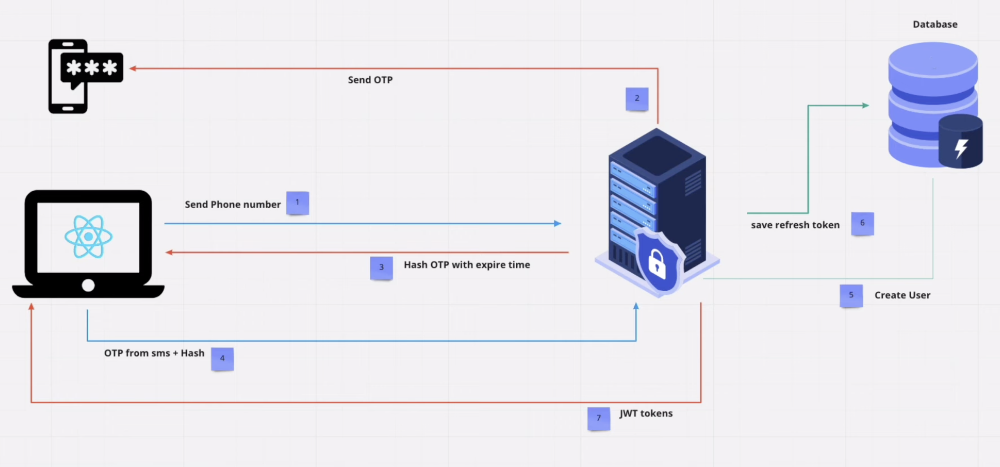
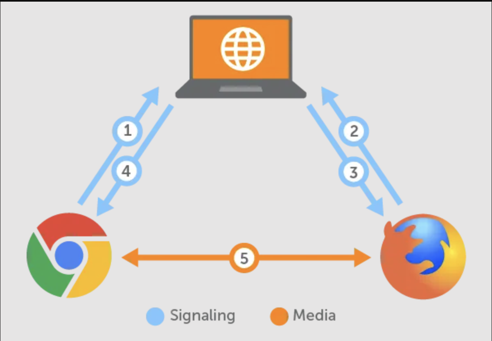
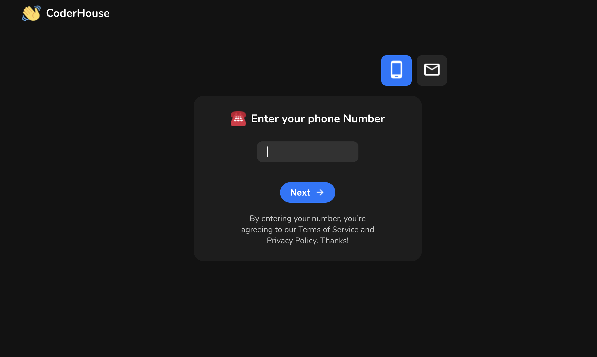
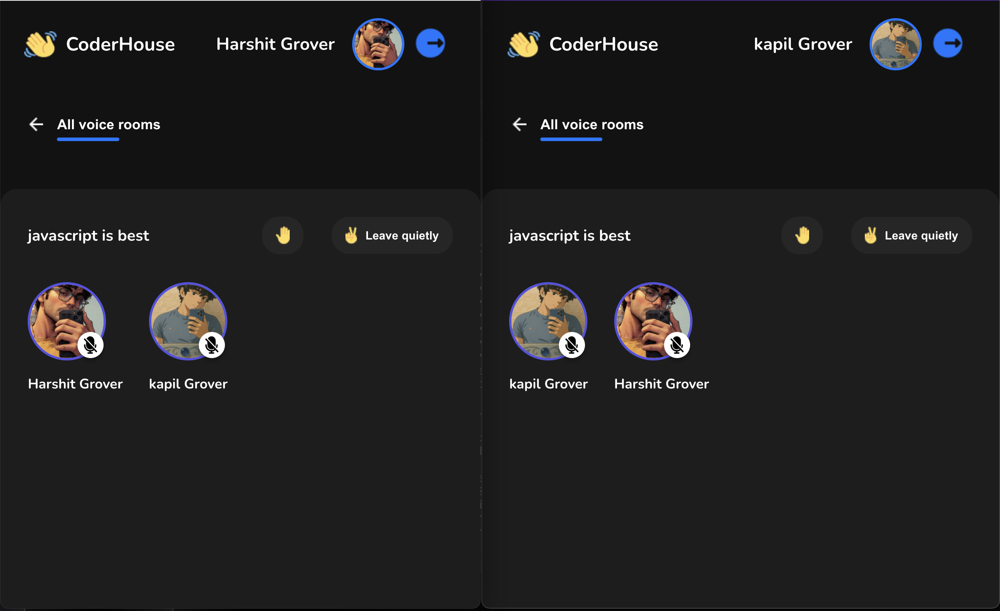
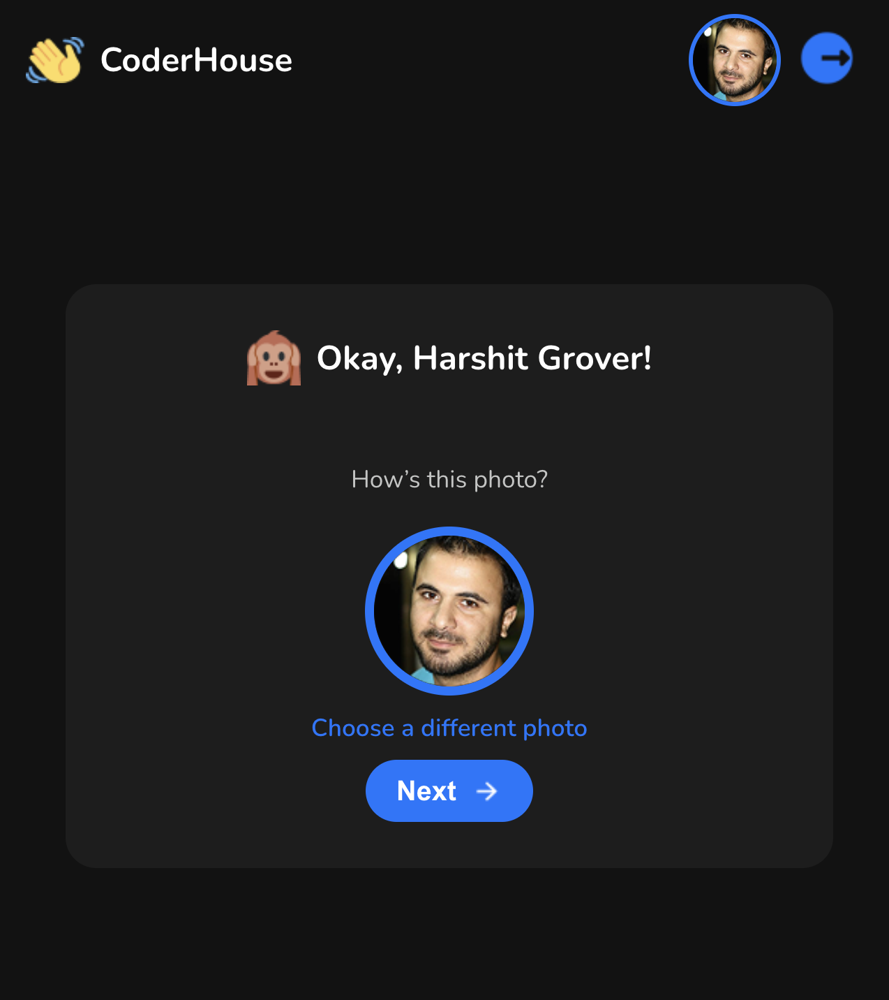

# 📞 Coderhouse - Voice Calling App

**Coderhouse** is a secure, full-stack voice calling application built with **WebRTC** and **WebSockets** for real-time communication. It supports **room creation**, **group calling**, and robust authentication including **OTP login** and **refresh token rotation** for secure sessions.

---

## 🚀 Overview

This app allows users to join voice calls in real-time, create or join rooms, and securely authenticate with OTP via phone or email. Token-based authentication with **refresh token rotation** ensures advanced session security.

---

## 🧩 Features

- 🔐 **OTP Authentication** via Email or Phone
- 🔄 **Access & Refresh Token** system with auto-refresh via interceptors
- 👤 **User Profile Setup**
- 📞 **Voice Calling** using **WebRTC**
- 🏠 **Room Creation & Management**
- 👥 **Group Calling** Support
- 🌐 **WebSocket-based Live User Presence**
- 💡 **Responsive UI** optimized for mobile and desktop

---

## 🛠️ Tech Stack

**Frontend:**
- React + Vite
- WebRTC API
- Axios (with token interceptor)
- Socket.IO Client

**Backend:**
- Node.js + Express
- WebSocket with Socket.IO
- MongoDB (via Mongoose)
- JWT-based Authentication
- OTP system

---
### ARCHITECTURE
### OTP


### WebRTC


---

## 📷 Screenshots

> Place your screenshots in the `screenshots/` folder and reference them below.

### 🔐 OTP Login


### 📞 Voice Call Room


### 👤 Profile Setup



---

## 📦 How to Run the Project Locally

> This guide assumes you have **Node.js** and **MongoDB** installed. MongoDB can also be hosted on [MongoDB Atlas](https://www.mongodb.com/cloud/atlas).

---

## 🔧 Setup Instructions

```bash
# Clone the repository
git clone https://github.com/yourusername/Coderhouse.git
cd Coderhouse

# Set up backend
cd backend
npm install
# Add your .env file with MongoDB URI, JWT_SECRET, etc.
npm start

# Set up frontend
cd ../frontend
npm install
# Add your VITE_BACKEND_URL in .env
npm run dev
